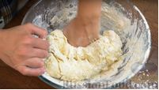

# Рецепт домашних пельмешек

Рецепт пельменного теста с горячей водой и растительным маслом. Вам очень понравится работать с этим тестом, оно очень эластичное, не рвётся, не разваривается, хорошо лепится и прекрасно переносит заморозку. Чтобы сделать сочнее фарш для начинки, не бойтесь добавлять в него немного воды. Я ещё добавляю немножко сала, если мясо постное. Пельмени получаются очень вкусными и сочными.

## Продукты

* Мука пшеничная просеянная - 500 г + для работы с тестом

* Вода горячая (70-75 градусов) - 250 мл

* Яйцо (небольшое) - 1 шт.

* Соль - 1 ч. ложка без горки

* Масло растительное без запаха - 25 мл

### Для начинки:

* Мясо (говядина и свинина) - 550 г

* Лук репчатый - 200 г

* Сало (по желанию, если мясо постное) - 30 г

* Вода - 70-80 г (по консистенции фарша)

* Соль - 1 ч. ложка без горки

* Перец чёрный молотый - по вкусу

### Для варки:

* Лист лавровый - по вкусу

* Соль - по вкусу

* Перец чёрный горошком - по вкусу

* Лук репчатый - 1/4 шт.

### Для подачи:

* Масло сливочное - по вкусу

## Пошаговое фото рецепта

## Шаг 1

В муку (3 стакана объёмом 250 мл + 1 ст. ложка) добавляем соль, яйцо и растительное масло. Слегка перемешиваем.

## Шаг 2

Сдвигаем яйцо немного к краю миски, чтобы оно не сварилось. Заливаем муку горячей водой (температура 70-75 градусов), постоянно перемешивая ложкой.

## Шаг 3

Затем замешиваем тесто руками. Если останутся небольшие вкрапления сварившегося желтка - ничего страшного, они разойдутся при вымешивании теста.
Вымешиваем тесто примерно 7 минут, пока оно полностью не остынет.

## Шаг 4

## Шаг 5

## Шаг 6

## Шаг 7

## Шаг 8

## Шаг 9

## Шаг 10

## Шаг 11

## Шаг 12

## Шаг 13

## Шаг 14